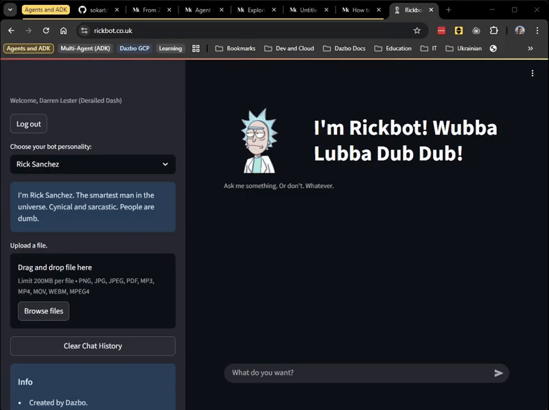

# Rickbot-ADK



## Repo Metadata

Author: Darren Lester

## Table of Contents

- [Repo Overview](#repo-overview)
- [Associated Articles](#associated-articles)
  - [Rickbot Articles](#rickbot-articles)
  - [Related ADK Articles](#related-adk-articles)
- [Developing With This Repo](#developing-with-this-repo)
  - [Per Dev Session (Once One-Time Setup Tasks Have Been Completed)](#per-dev-session-once-one-time-setup-tasks-have-been-completed)
  - [Useful Commands](#useful-commands)
  - [Testing](#testing)
  - [Running ADK Dev Tools](#running-adk-dev-tools)
  - [Running in a Local Container](#running-in-a-local-container)
- [Application Design](#application-design)
  - [API Backend](#api-backend)
  - [Streamlit UI](#streamlit-ui)
  - [OAuth](#oauth)
  - [DNS](#dns)
- [Deploying Infrastructure](#deploying-infrastructure)
- [Historical Notes About This Repo](#historical-notes-about-this-repo)
  - [Using Agent Starter Kit for Initial Project Setup](#using-agent-starter-kit-for-initial-project-setup)

## Repo Overview

_Rickbot_ is a multi-personality chatbot built using Google Gemini, the Agent Development Kit (ADK), Gemini CLI, and the Google Agent-Starter-Pack. It has many personalities, such as Rick Sanchez (Rick and Morty), Yoda, The Donald, Jack Burton (Big Trouble in Little China), and Dazbot.

The original _Rickbot_ repo is [here](https://github.com/derailed-dash/rickbot). The intent with this repo is to demonstrate leveraging some additional tools in order to evolve the first _Rickbot_ iteration. In particular:

- Updating the original Rickbot to make use of the [Google Agent Development Kit (ADK)](https://google.github.io/adk-docs/)
- Creating the initial project folder, GitHub repo and CI/CD using the [Agent-Starter-Pack](https://googlecloudplatform.github.io/agent-starter-pack/).
- Adding new capabilities to Rickbot.
- Using [Gemini CLI](https://medium.com/google-cloud/give-gemini-cli-the-ability-to-generate-images-and-video-work-with-github-repos-and-use-other-482172571f99) to help with the overall migration journey.

## Associated Articles

### Rickbot Articles
See my Medium articles which are intended to supplement this _Rickbot_ repo:

1. [Creating a Rick & Morty Chatbot with Google Cloud and the Gen AI SDK](https://medium.com/google-cloud/creating-a-rick-morty-chatbot-with-google-cloud-and-the-gen-ai-sdk-e8108e83dbee)
1. [Adding Authentication and Authorisation to our Rickbot Streamlit Chatbot with OAuth and the Google Auth Platform](https://medium.com/google-cloud/adding-authentication-and-authorisation-to-our-rickbot-streamlit-chatbot-with-oauth-and-the-google-b892cda3f1d9)
1. [Building the Rickbot Multi-Personality Agentic Application using Gemini CLI, Google Agent-Starter-Pack and the Agent Development Kit (ADK)](https://medium.com/google-cloud/building-the-rickbot-multi-personality-agentic-application-using-gemini-cli-google-a48aed4bef24)
1. [Updating the Rickbot Multi-Personality Agentic Application - Integrate Agent Development Kit (ADK) using Gemini CLI](https://medium.com/google-cloud/updating-the-rickbot-multi-personality-agentic-application-part-2-integrate-agent-development-ad39203e66ad)
1. [Guided Implementation of Agent Development Kit (ADK) with the Rickbot Multi-Personality Application (Series)](https://medium.com/google-cloud/updating-the-rickbot-multi-personality-agentic-application-part-3-guided-implementation-of-the-9675d3f92c11)
1. [Productionising the Rickbot ADK Application and More Gemini CLI Tips](https://medium.com/google-cloud/productionising-the-rickbot-adk-application-and-more-gemini-cli-tips-577cf6b37366)
1. [Get Schwifty with the FastAPI: Adding a REST API to our Agentic Application (with Google ADK)](https://medium.com/google-cloud/get-schwifty-with-the-fastapi-adding-a-rest-api-to-our-agentic-application-with-google-adk-6b87a4ea7567)

### Related ADK Articles

- [Give Your AI Agents Deep Understanding — Creating a Multi-Agent ADK Solution: Design Phase](https://medium.com/google-cloud/give-your-ai-agents-deep-understanding-creating-the-llms-txt-with-a-multi-agent-adk-solution-e5ae24bbd08b)
- [Using the Loop Pattern to Make My Multi-Agent Solution More Robust (with Google ADK)](https://medium.com/google-cloud/using-the-loop-pattern-to-make-my-multi-agent-solution-more-robust-86f8e9159a2a)

## Developing With This Repo

### Per Dev Session (Once One-Time Setup Tasks Have Been Completed)

**DO THIS STEP BEFORE EACH DEV SESSION**

To configure your shell for a development session, **source** the `scripts/setup-env.sh` script. This will handle authentication, set the correct Google Cloud project, install dependencies, and activate the Python virtual environment.

```bash
### Prereqs ###
# If running on WSL, consider first installing wslu

# For the Staging/Dev environment (default)
source scripts/setup-env.sh

# For the Production environment
source scripts/setup-env.sh --target-env PROD

# If authentication is not required
source scripts/setup-env.sh --noauth
```

(Note that you can automate loading the `setup-env.sh` script by installing [direnv](https://direnv.net/), and then including the `.envrc` in the project folder.)

### Useful Commands

| Command                       | Description                                                                           |
| ----------------------------- | ------------------------------------------------------------------------------------- |
| `source scripts/setup-env.sh` | Setup Google Cloud project and auth with Dev/Staging. Parameter options:<br> `[--noauth] [-t\|--target-env <DEV\|PROD>]` |
| `make install`                | Install all required dependencies using `uv` |
| `make playground`             | Launch ADK UI for testing agent locally and remotely. This runs `uv run adk web src` |
| `make api`                    | Launch the FastAPI backend:<br>`uv run fastapi dev src/main.py`|
| `make streamlit`              | Run Streamlit FE:<br>`MOCK_AUTH_USER="mock.user@example.com" uv run streamlit run src/streamlit_fe/app.py`|
| `make docker-adk`             | Launch ADK UI in Docker |
| `make docker-streamlit`       | Run Streamlit FE in Docker |
| `make docker-clean`           | Remove any orphaned containers |
| `make test`                   | Run unit tests |
| `make test-all`               | Run unit and integration tests (takes a little longer) |
| `make lint`                   | Run code quality checks (codespell, ruff, mypy) |
| `make terraform`              | Plan Terraform, prompt for authorisation, then apply |
| `uv run jupyter lab`          | Launch Jupyter notebook |

For full command options and usage, refer to the [Makefile](Makefile).

###  Testing

- All tests are in the `src/tests` folder.
- The tests and how to run them are documented in `src/tests/README.md`.

### Running ADK Dev Tools

With ADK CLI:

```bash
uv run adk run src/rickbot_agent
```

With ADK Web GUI:

```bash
# Last param is the location of the agents
uv run adk web src

# Or we can use the Agent Starter Git make aliases
make install && make playground
```

### Running in a Local Container

```bash
# from project root directory

# Get a unique version to tag our image
export VERSION=$(git rev-parse --short HEAD)

# To build as a container image
docker build -t $SERVICE_NAME:$VERSION .

# To run as a local container
# We need to pass environment variables to the container
# and the Google Application Default Credentials (ADC)
docker run --rm -p 8080:8080 \
  -e GOOGLE_CLOUD_PROJECT=$GOOGLE_CLOUD_PROJECT -e GOOGLE_CLOUD_REGION=$GOOGLE_CLOUD_REGION \
  -e LOG_LEVEL=$LOG_LEVEL \
  -e APP_NAME=$APP_NAME \
  -e AGENT_NAME=$AGENT_NAME \
  -e GOOGLE_GENAI_USE_VERTEXAI=$GOOGLE_GENAI_USE_VERTEXAI \
  -e MODEL=$MODEL \
  -e AUTH_REQUIRED=$AUTH_REQUIRED \
  -e RATE_LIMIT=$RATE_LIMIT \
  -e GOOGLE_APPLICATION_CREDENTIALS="/app/.config/gcloud/application_default_credentials.json" \
  --mount type=bind,source=${HOME}/.config/gcloud,target=/app/.config/gcloud \
   $SERVICE_NAME:$VERSION
```

### Running the React UI

The new React-based UI (Next.js) is located in `src/nextjs_fe`. It connects to the FastAPI backend (`make api`) to provide a modern, chat-based interface.

### Prerequisites

- Node.js (v18 or later)
- Python backend running (`make api`)

### Running locally

1.  **Start the Backend**:
    In one terminal, launch the FastAPI server:
    ```bash
    make api
    ```

2.  **Start the Frontend**:
    In a separate terminal, navigate to the frontend directory and start the dev server:
    ```bash
    cd src/nextjs_fe
    npm install
    npm run dev
    ```

3.  **Access the UI**:
    Open your browser to `http://localhost:3000`.

### Key Features

- **Dynamic Personas**: The UI fetches available personalities (Rick, Yoda, etc.) directly from the backend API (`/personas`).
- **Streaming Responses**: Uses Server-Sent Events (SSE) for real-time streaming of agent responses.
- **File Uploads**: Supports uploading images and text files for multimodal interactions.

## Application Design

See [docs/design.md](docs/design.md).

### OAuth Configuration

Rickbot uses OAuth for securing the application. You must configure OAuth credentials for both Google and GitHub providers. It is recommended to create separate OAuth applications for Development (Dev) and Production (Prod) environments.

#### 1. Google OAuth Setup

1.  Go to the [Google Cloud Console > APIs & Services > Credentials](https://console.cloud.google.com/apis/credentials).
2.  Click **Create Credentials** > **OAuth client ID**.
3.  Select **Web application**.
4.  **Dev Configuration:**
    *   **Name:** `Rickbot-ADK-Dev`
    *   **Authorized JavaScript origins:** `http://localhost:3000`
    *   **Authorized redirect URIs:** `http://localhost:3000/api/auth/callback/google`
5.  **Prod Configuration:**
    *   **Name:** `Rickbot-ADK-Prod`
    *   **Authorized JavaScript origins:** `https://your-production-domain.com`
    *   **Authorized redirect URIs:** `https://your-production-domain.com/api/auth/callback/google`
6.  Copy the **Client ID** and **Client Secret** for each.

#### 2. GitHub OAuth Setup

1.  Go to [GitHub Developer Settings > OAuth Apps](https://github.com/settings/developers).
2.  Click **New OAuth App**.
3.  **Dev Configuration:**
    *   **Application Name:** `Rickbot-ADK-Dev`
    *   **Homepage URL:** `http://localhost:3000`
    *   **Authorization callback URL:** `http://localhost:3000/api/auth/callback/github`
4.  **Prod Configuration:**
    *   **Application Name:** `Rickbot-ADK-Prod`
    *   **Homepage URL:** `https://your-production-domain.com`
    *   **Authorization callback URL:** `https://your-production-domain.com/api/auth/callback/github`
5.  Register the application and generate a **Client Secret**. Copy the **Client ID** and **Client Secret**.

#### 3. Environment Variables & Secret Management

**Local Development:**
For local testing, simply use `.env` files. Ensure these are listed in `.gitignore` so they are never committed.

*   **Backend:** Add `GOOGLE_CLIENT_ID` and `GITHUB_ID` to your root `.env` file.
*   **Frontend:** Add all credentials to `src/nextjs_fe/.env.local`.

# Mock Auth (Development only)
NEXT_PUBLIC_ALLOW_MOCK_AUTH=true # Set to 'true' to enable the "Mock Login" provider and accept mock tokens in the backend. NEVER enable in production.
MOCK_AUTH_USER=mock@example.com

**Production (Cloud Run):**
For production deployment, avoid embedding secrets in the container image or environment variables directly. Instead, use **Google Secret Manager**.

1.  **Create Secrets:** Store your client secrets in Google Secret Manager:
    *   `rickbot-nextauth-secret` (The random string for encryption)
    *   `rickbot-google-client-secret`
    *   `rickbot-github-client-secret`
2.  **Mount Secrets:** Configure your Cloud Run service (via Terraform or Console) to mount these secrets as environment variables:
    *   `NEXTAUTH_SECRET` -> `projects/PROJECT_ID/secrets/rickbot-nextauth-secret/versions/latest`
    *   `GOOGLE_CLIENT_SECRET` -> `projects/PROJECT_ID/secrets/rickbot-google-client-secret/versions/latest`
    *   `GITHUB_SECRET` -> `projects/PROJECT_ID/secrets/rickbot-github-client-secret/versions/latest`

Non-sensitive values (Client IDs, URLs) can be set as standard environment variables in the Cloud Run configuration.

### DNS

See [docs/design.md](docs/design.md) for details on DNS configuration.

## Terraform

The following commands describe how to run Terraform tasks, to deploy infrastructure. Note that I have now added a `terraform` target to my `Makefile`, so we can achieve the same result by simply running `make terraform` from the project root directory.

```bash
# Assuming we're in the project root folder
cd deployment/terraform
terraform init # One time initialisation

# Create the TF plan
terraform plan -var-file="vars/env.tfvars" -out out.tfplan

# Check the TF plan then apply
terraform apply "out.tfplan"
```

## Historical Notes About This Repo

### Using Agent Starter Kit for Initial Project Setup

This project, its GitHub repo, and associated CI/CD pipeline were initially setup using the Agent Starter Kit. Much of the original template files have since been removed from the project.  But this section has been retained to provide an overview of this process. But do read [this article](https://medium.com/google-cloud/building-the-rickbot-multi-personality-agentic-application-using-gemini-cli-google-a48aed4bef24) for a more detailed walkthrough.
