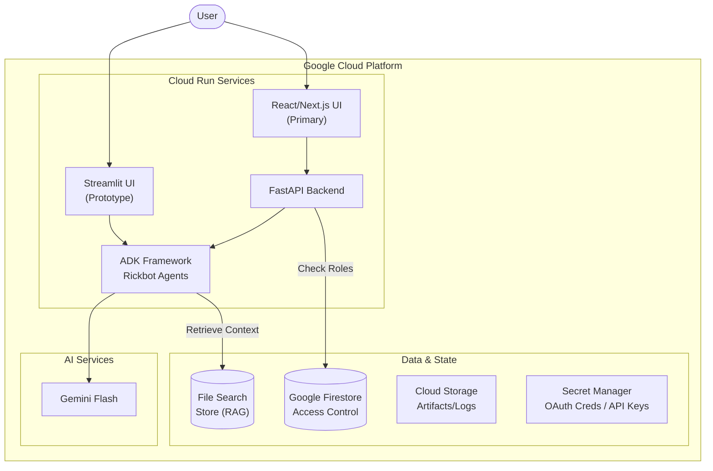

# Rickbot-ADK Design Documentation

## Overall Purpose

**Rickbot-ADK** represents the evolution of the original "Rickbot" chatbot into a sophisticated, multi-agent system. Its primary purposes are:

1.  **Platform Demonstration**: To serve as a reference implementation for creating advanced agents using the **Google Agent Development Kit (ADK)**, **Gemini CLI**, and the **Agent-Starter-Pack**.
2.  **Multi-Personality Architecture**: To demonstrate how to build a flexible agent architecture capable of robustly switching between distinct personas (e.g., Rick Sanchez, Yoda, Dazbot) while maintaining conversational coherence.

## Solution Design

The solution is architected as a cloud-native application running on Google Cloud, leveraging Vertex AI / Gemini for intelligence. It is containerised and can be deployed onto Google Cloud Run for compute.

### High-Level Architecture

### Container Architecture Strategy

We evaluated three potential architectures for deploying the Rickbot Backend (FastAPI) and Frontend (Next.js) to Google Cloud Run.

#### Option 1: Separate Cloud Run Services (Microservices)

Deploy the API and Frontend as two completely independent Cloud Run services.
*   **Pros**:
    *   **Independent Scaling**: Frontend and Backend can scale to zero or up to N instances independently based on their specific utility.
    *   **Decoupled Lifecycle**: You can deploy a fix to the frontend without redeploying the backend.
*   **Cons**:
    *   **Complexity**: Requires managing two separate CI/CD pipelines, two sets of domains, and CORS configuration.
    *   **Inter-Service Auth**: To secure the backend, the frontend must authenticate its request. This implies managing Service Accounts, granting `run.invoker` IAM roles, and implementing logic in the frontend code to fetch and attach Google ID-tokens to every API request.
    *   **Cost (TCO)**: Minimum instance counts (if used) apply to both services, doubling the base cost. Network latency is introduced between the two services.

#### Option 2: Sidecar Pattern (Two Containers, One Service)

Deploy both containers within a *single* Cloud Run service using the sidecar pattern.
*   **Pros**:
    *   **Localhost Communication**: The frontend talks to the backend over `localhost`, eliminating latency and public internet exposure.
    *   **Single Domain**: One service handles ingress.
*   **Cons**:
    *   **Complexity**: Cloud Run sidecar support is powerful but adds YAML/Terraform complexity.
    *   **Resource Contention**: Both containers share the instance's CPU/RAM. If one spikes, the other suffers.
    *   **Cold Starts**: Both containers must initialize before the service is ready, potentially increasing cold start times.

#### Option 3: Unified Container (Selected Strategy)

Merge both applications into a single Docker image (using a multi-stage build that combines Python/FastAPI and Node/Next.js runtimes) and manage them with a lightweight orchestration script.
*   **Pros**:
    *   **Simplicity**: It effectively behaves like a "monolith". One Dockerfile, one deploy command, one service to monitor.
    *   **Cost Efficiency**: Lowest possible TCO. Only one service consumes resources.
*   **Cons**:
    *   **Image Size**: The single resulting image is larger (~1.4GB) as it contains both runtimes.
    *   **Coupled Lifecycle**: A change to a CSS file requires rebuilding and redeploying the entire container stack.

#### Decision

We chose **Option 3: Unified Container**.
Given that Rickbot is a reference implementation with expectations of relatively low and sporadic usage, the priority was to **minimize Total Cost of Ownership (TCO)** and infrastructure complexity. The Unified Container offers the simplest "Zero to Cloud" path for developers while staying well within the free/low-cost tiers of Cloud Run.

### Container Best Practices

Regardless of the architecture strategy, we apply rigorous best practices to our image builds:

1.  **Multi-Stage Builds**:
    -   **API**: Uses a "builder" stage to compile dependencies with `uv`, then copies only the necessary virtual environment and source code to the final runtime image.
    -   **Frontend**: Uses a "builder" stage to compile the Next.js app, then copies only the standalone production artifacts to the final image.
    -   **Unified**: Combines the outputs of both builders into a single runtime image.

2.  **Security**:
    -   **Non-Root Execution**: All containers are configured to run as non-root users (`app-user`).
    -   **Minimal Base Images**: We use `python:slim` and `node:alpine` where possible to reduce attack surface.
    -   **Whitelist Copying**: Dockerfiles explicitly copy only required source code to prevent sensitive file leaks.

### Implementation Details & Workarounds

#### 1. RAG Stability & File Search (Gemini Developer API)

To support RAG capability using the Gemini Developer API's "File Search" feature (which is distinct from Vertex AI Search), the application implements specific middleware:

*   **Client Monkey-Patching**: The ADK framework defaults to using Vertex AI clients when running in a Google Cloud environment. To force the use of the Gemini Developer API (AI Studio) for File Search, we monkey-patch `google.genai.Client` at runtime in `src/rickbot_agent/agent.py`. This forces `vertexai=False` and ensures correct API Key injection.
*   **Timeout Handling**: Due to gRPC transport issues in certain containerized environments, the client is configured with a robust timeout (`60000 ms`) to allow sufficient time for RAG retrieval operations to complete.

#### 2. Streaming Reliability (SSE Buffering)

To ensure smooth "Typewriter" effects and "Thinking" indicator updates over Server-Sent Events (SSE):

*   **Compression**: Logic is implemented (or compression disabled via `next.config.js`) to prevent Gzip buffering from holding back small status update events.
*   **Padding**: The backend injects 4KB of whitespace padding after critical `tool_call` events to force network buffers to flush immediately, ensuring the UI receives the "Thinking..." signal without delay.

#### 3. Secrets & Key Management

The application supports a dual-mode configuration for flexibility:
*   **Google Cloud Project**: If `GOOGLE_CLOUD_PROJECT` is set, the system attempts to auto-discover credentials.
*   **Gemini API Key**: If `GOOGLE_GENAI_USE_VERTEXAI` is false, a `GEMINI_API_KEY` is required. This is injected securely via Secret Manager (Prod) or `.env` (Dev).

- **GCS Artifacts**: Lifecycle policies are configured to manage storage costs.
- **Firestore PITR**: Point-in-Time Recovery (PITR) is enabled for Firestore databases, providing a 7-day retention window for data recovery and point-in-time reads.

*   **Hosting Services**:
    *   **Google Cloud Run**: Hosts both the generic API backend and the frontend containers.
        *   **Unified Container Deployment**: The production architecture deploys a single container image that includes both the API Backend and React UI. This simplifies deployment, reduces costs, and eliminates the need for complex networking or sidecar configurations.
        *   **Authentication (IAP)**: Identity-Aware Proxy (IAP) was utilized in the staging environment during the early development stages as a temporary measure before full OAuth integration was complete. Now that OAuth is fully functional, IAP has been disabled.
    *   Cloud Run provides a serverless, scalable environment. It also offers a native domain name mapping feature to map custom domains to our Cloud Run services. Note that any custom domains used must be added to the OAuth authorised domains and authorised redirect URIs. 
*   **Agentic Services**:
    *   **Vertex AI Agent Engine**: The core runtime for the agent.
    *   **Google Gemini Models**: The underlying Large Language Models (LLMs) driving the personalities (e.g., `gemini-2.5-flash`).
    *   **Google Agent Development Kit (ADK)**: Provides the standardized framework for agent state management, pattern implementation, and multi-turn conversation handling.
*   **API Layer**:
    *   **FastAPI**: Powers the backend API, exposing RESTful endpoints.
*   **Frontend**:
    *   **Streamlit**: Powers the current frontend user interface for rapid prototyping. (Built using `Dockerfile.streamlit`).
    *   **Next.js / React (Primary)**: The modern, material-design chat interface located in `src/nextjs_fe`. (Built using `src/nextjs_fe/Dockerfile`).
*   **Auth**:
    *   **Google Auth Platform**: Handles OAuth 2.0 authentication for users.
*   **Data, Infrastructure & Tools**:
    *   **Google Cloud Storage (GCS)**: Stores unstructured data, logs, and generated artifacts.
    *   **File Search Store (Gemini Developer API)**: Acts as the knowledge base for RAG (Retrieval Augmented Generation), allowing specific personalities to reference uploaded documents.
        > Note: This uses the Gemini Developer API and is managed via `notebooks/file_search_store.ipynb`.
    *   **Secret Manager**: Securely stores sensitive configuration like OAuth client IDs and API keys.
        *   **Production**: Cloud Run services are configured to mount these secrets directly as environment variables at runtime.
        *   **Local Development**: Secrets are loaded from local, git-ignored `.env` files (e.g., `src/nextjs_fe/.env.local`) to emulate the production environment without exposing credentials in the codebase.
    *   **Terraform**: Manages all infrastructure provisioning.
    *   **Google Cloud Build**: Orchestrates the CI/CD pipeline for testing and deployment.

## Design Decisions

### 1. Adopting the Agent Development Kit (ADK)

*   **Decision**: Migrate from custom Python logic to the Google ADK.
*   **Rationale**: The original Rickbot used ad-hoc state management which became brittle. ADK provides robust, standardized patterns for session handling, tool calling, and context management, making the system easier to extend and maintain.

### 2. Decoupling the API (FastAPI)

*   **Decision**: Expose the agent's functionality via a standalone FastAPI service (`src/main.py`), rather than embedding it tightly within the UI code.
*   **Rationale**: This follows the "Backend for Frontend" (BFF) pattern conceptually but allows multiple interfaces to coexist. It enables the development of the planned React/Next.js UI without modifying the core agent logic and allows third-party integrations (e.g., Slack bot, mobile app) in the future.

### 3. Streamlit for Initial UI

*   **Decision**: Use Streamlit for the first-generation user interface.
*   **Rationale**: Streamlit allows for extremely rapid prototyping using only Python. It was the fastest way to validate the ADK integration and multi-personality logic before investing in a more complex React frontend.

### 4. Runner Re-initialization for Context Isolation (Streamlit vs API)

*   **Decision**: Handle persona switching differently based on the interface's nature.
    *   **Streamlit (Stateful)**: Forces a full re-initialization of the ADK `Runner` instance when the selection changes. This guarantees zero "context leakage" for the stateful UI.
    *   **FastAPI (Stateless)**: 
        *   **Per-Request Lifecycle**: The API is designed to be effectively stateless regarding the agent configuration. It accepts a `personality` parameter on every request (header or query param).
        *   **Dynamic Instantiation**: For each incoming request, the backend checks if the requested personality matches the cached runner. If not, or if it's a new request, it instantiates the appropriate agent configuration on-the-fly.
        *   **Scope**: The agent instance is strictly scoped to the individual request lifecycle (or a short-lived cache), ensuring that a request for "Yoda" never accidentally receives context or behaviors from a previous "Rick" request.
*   **Rationale**: The Streamlit app simulates a continuous session with a specific character, requiring a hard reset to switch. The API is designed to be flexible and stateless, allowing a client to potentially mix-and-match or switch personalities instantly between calls without backend reconfiguration.

### User Interfaces (UIs)

The application supports multiple distinct interfaces, all interacting with the core agent logic.

#### Streamlit UI

The original user interface for rapid prototyping and demonstration. 
This UI is defined in `src/streamlit_fe/app.py` and can be launched with `make streamlit`.

Alternatively, we can launch it in a Docker container using `make docker-streamlit`.

*   **Technology**: Python, Streamlit.
*   **Features**:
    *   **Sidebar Navigation**: Allows users to select between different personalities.
    *   **Chat Interface**: A familiar chat-bubble layout for interacting with the agent.
    *   **Authentication**: Integrated OIDC authentication using Google Auth Platform.
    *   **State Management**: Handles session persistence locally within the Streamlit session state.

##### Handling Personality Changes in the Streamlit UI

The application is designed to ensure a clean and robust separation of context when switching between different chatbot personalities. The process is handled as follows:

1.  **UI Detection**: When a user selects a new personality from the sidebar dropdown in the Streamlit UI, the application immediately detects this change.
2.  **State Reset**: To prevent conversational context from leaking between personalities, the application clears the current chat history.
3.  **Application Rerun**: It then programmatically triggers a full rerun of the Streamlit application.
4.  **Runner Re-initialization**: During the rerun, the application logic detects that the personality has changed. This triggers the creation of a **brand new ADK `Runner` instance**.
5.  **New Agent Configuration**: The new `Runner` is configured with a fresh agent that embodies the newly selected personality. The old `Runner` instance is discarded and garbage-collected.

This approach ensures that each personality operates in a clean, isolated environment. It is a simple and robust pattern that aligns well with Streamlit's execution model, prioritizing a predictable state over the premature optimization of object re-creation.

#### React/Next.js UI

The modern, production-grade interface for Rickbot, located in `src/nextjs_fe`.

*   **Technology**: TypeScript, React, Next.js, Material UI (MUI).
*   **Architecture**: Client-side application consuming the **FastAPI Backend**.
*   **Features**:
    *   **Modern UX**: Enhanced aesthetics and responsiveness using Material UI (MUI).
    *   **Dynamic Configuration**: Fetches available personalities dynamically from the backend (`/personas` endpoint), ensuring the UI is always in sync with the agent configuration.
    *   **Real-time Interaction**: Uses Server-Sent Events (SSE) via the `/chat_stream` endpoint for a responsive, streaming chat experience.
    *   **Interactive Tool Visibility**: Real-time visual feedback on agent actions, displaying specific tool usage (e.g., Google Search, File Search) with icons and status indicators within the "Thinking" state.
    *   **Multimodal Support**: Supports file uploads (images, text) alongside chat messages.
    *   **Independent Auth**: Implements its own OAuth flow.

### API Backend

The central nervous system of the application. It is the primary entrypoint to the application is a FastAPI backend, defined in `src/main.py`. This provides a RESTful API that allows any client that can speak HTTP to interact with the Rickbot agent. This decoupled architecture allows for the development of custom user interfaces (such as a React-based web application) and enables other applications to integrate with Rickbot.

*   **Technology**: Python, FastAPI.
*   **Role**: Exposes the ADK agent as a set of RESTful endpoints.
*   **Capabilities**:
    *   Stateless/Stateful conversation handling (via ADK).
    *   **Dynamic Configuration**: Exposes `/personas` endpoint to drive UI configuration.
    *   Swagger/OpenAPI documentation auto-generation.
    *   Serves as the single source of truth for agent logic for all connected UIs.

### OAuth

Frontend user authentication is required for Rickbot.

#### OAuth with Streamlit

- With the Streamlit frontend this is achieved using Streamlit's integrated OIDC authentication. 
- We use Google Auth Platform as the OAuth2 Auth provider.
- OAuth credentials are obtained from the Google Auth Platform and stored in Google Secret Manager.
- When the application is first launched, these credentials are read and dynamically written to the `.streamlit/secrets.toml`, which is how the Streamlit OIDC works. We must provide the `oauth2callback` URI as well as the OAuth client ID and secret.
- Different credentials are used between Staging and Prod.
- When running locally we use an environment variable `MOCK_AUTH_USER` to bypass real authentication. This is automatically set by `make streamlit`.

#### OAuth with Next.js

- **Framework**: **NextAuth.js**.
- **Rationale**: NextAuth.js is the standard authentication solution for Next.js applications. It abstracts the complexity of OAuth flows, session management, and secure cookie handling. It supports multiple providers out-of-the-box and is highly extensible.
- **Implementation**:
    - **Frontend (Next.js)**: 
        - Configured with `GoogleProvider` and `GitHubProvider` for external authentication.
        - Uses a custom `CredentialsProvider` for a "Mock Login" flow during local development, enabling offline testing.
        - Session state is managed via secure HTTP-only cookies encrypted with `NEXTAUTH_SECRET`.
        - The `useSession` hook provides reactive access to user state in React components.
    - **Backend (FastAPI)**:
        - The backend is stateless regarding authentication but enforces authorization.
        - Endpoints are secured using `HTTPBearer` dependency.
        - It validates the tokens passed by the frontend:
            - **Google Tokens**: Verified using `google-auth` library against the Google ID Token issuer.
            - **GitHub Tokens**: Verified by calling the GitHub User API.
            - **Mock Tokens**: Verified by parsing a custom mock token format.
                - **Security**: Mock auth is controlled by two distinct environment variables:
                    - `NEXT_PUBLIC_ALLOW_MOCK_AUTH`: Controls UI visibility of the mock login provider.
                    - `BACKEND_ALLOW_MOCK_AUTH`: Controls whether the backend accepts mock tokens.
                - **Usage**: STRICTLY for local development. `BACKEND_ALLOW_MOCK_AUTH` should be falsy in production.
- **Configuration**:
    - **Local Development**: OAuth credentials (Client ID/Secret) are loaded from `.env.local`.
    - **Production**: Credentials are securely fetched from **Google Secret Manager** and injected as environment variables into the Cloud Run container.

### Rate Limiting

To ensure the stability and availability of the Rickbot-ADK platform, rate limiting is implemented at the API level.

*   **Framework**: **slowapi** (a FastAPI port of `limits`).
*   **Storage**: **In-memory storage** (default). Note that rate limits are currently local to each instance of the API server.
*   **Key Identification**:
    *   **Authenticated Users**: Requests are tracked using the unique **User ID** extracted from the verified JWT.
        > **Technical Detail**: This is achieved via a custom `AuthMiddleware` that runs *before* the rate limiting middleware (`SlowAPIMiddleware`). It passively attempts to verify the token and populate `request.state.user` so `slowapi` can use it for the key function.
    *   **Unauthenticated Users**: Requests are tracked by the **Client IP address** as a fallback.
*   **Policies**:
    *   **Global Default**: 60 requests per minute.
    *   **LLM Generation**: 5 requests per minute for `/chat` and `/chat_stream`. This stricter limit is necessary to manage the high computational cost and external API quotas associated with Gemini model inference.
*   **Error Handling**:
    *   Exceeding a limit triggers a `429 Too Many Requests` response.
    *   The response includes a `Retry-After: 60` header to inform clients when they can resume requests.
    *   A custom exception handler ensures the response body is formatted as standard JSON: `{"detail": "Rate limit exceeded: ..."}`.

### Artifacts & Media Handling

The system leverages **ADK Artifacts** for robust handling of user-uploaded files and generated content.

1.  **Storage Strategy**:
    -   **Development**: Uses `InMemoryArtifactService` for transient storage. This is the default when the `ARTIFACT_BUCKET` environment variable is not set.
    -   **Production**: Uses `GcsArtifactService` to persist files in a dedicated Google Cloud Storage bucket. This is enabled by setting the `ARTIFACT_BUCKET` environment variable.
        > [!IMPORTANT]
        > The ADK **does not enforce any data retention policy** for GCS artifacts. Retention is determined entirely by the **Lifecycle Management policies** configured on your `ARTIFACT_BUCKET`. You must configure these policies in Google Cloud (e.g., delete objects > 30 days old) to avoid indefinite storage costs.

2.  **Upload Workflow (Next.js & API)**:
    -   **Design Choice**: To maintain a "stateless" API design and compatibility with ADK's `new_message` structure, the system uses a **Unified Chat Request** pattern.
    -   **Mechanism**:
        -   The frontend sends files *directly* in the `POST /chat` request using `multipart/form-data`.
        -   The backend endpoint (`src/main.py`) receives the file bytes.
        -   **Backend Action 1 (Persistence)**: It immediately saves the file using `ArtifactService.save_artifact()`. This ensures the file is versioned and stored (e.g., in GCS).
        -   **Backend Action 2 (Context)**: It constructs a `google.genai.types.Part` containing the `inline_data` (the file bytes). This `Part` is passed to the `Runner` along with the text prompt. This ensures the LLM has immediate access to the file content for the current turn.
    -   **Benefit**: This avoids complex multi-step "upload then reference" flows for the user, while still ensuring the backend maintains a persisted record of all media via the Artifact system.

3.  **Retrieval & Display**:
    -   **Inline Display**: The frontend (Next.js) renders the user's uploaded files immediately from its local state (what the user just dropped).
    -   **History Display**: For historical messages (reloaded sessions), the frontend relies on the message content.
    -   **Future Enhancement**: A dedicated `GET /artifacts/{filename}` endpoint will be exposed to allow secure retrieval of historical artifacts by authorized users.

### Access Control (RBAC)

To restrict access to certain personas based on user identity, the application implements a Role-Based Access Control (RBAC) system.

*   **Source of Truth**: **Google Firestore**.
*   **Authentication & Identity**: 
    *   The system uses **ASGI Middleware** (`AuthMiddleware`) to passively authenticate users by verifying Bearer tokens (Google ID Tokens, GitHub Access Tokens, or Mock Tokens).
    *   Verified identity is stored in the ASGI `scope["user"]`, making it accessible to subsequent dependencies.
*   **Access Enforcement**:
    *   Enforcement is handled by a FastAPI dependency (`check_persona_access`) applied to the `/chat` and `/chat_stream` endpoints.
    *   This dependency checks the user's role against the required role for the requested persona stored in Firestore.
    *   **Graceful Upsell**: If access is denied, the API returns a `403 Forbidden` response with a structured JSON body (`error_code: "UPGRADE_REQUIRED"`), triggering an upgrade modal in the frontend.
*   **Automated User Provisioning (Metadata Sync)**:
    *   The system automatically creates and updates user records in Firestore to simplify administration.
    *   **Synchronization Trigger**: Occurs when the frontend calls `/personas` immediately after a user signs in.
    *   **Fields**:
        *   `id`: The unique provider ID (e.g., Google `sub` or GitHub ID).
        *   `provider`: The identity provider (e.g., `google`, `github`, `mock`).
        *   `name`: Display name from the identity provider.
        *   `email`: User's email address.
        *   `role`: Defaults to `standard` for new users.
        *   `last_logged_in`: A Firestore server timestamp for housekeeping.
*   **Schema**:
    *   **`users` Collection**: 
        *   **Document ID**: Readable format `{name}:{provider}:{id}` (e.g., `DarrenLester:google:108579206256958314052`).
        *   **Querying**: The backend queries by the indexed `id` AND `provider` fields to find the document, ensuring complete account isolation and preventing cross-provider ID collisions.
    *   **`persona_tiers` Collection**: 
        *   **Document ID**: The lowercase persona ID (e.g., `dazbo`, `yasmin`).
        *   **Fields**: `required_role` (e.g., `standard`, `supporter`).
*   **Local Development & Testing**:
    *   **`BACKEND_ALLOW_MOCK_AUTH`**: This environment variable enables the verification of mock tokens (format: `mock:id:email:name`). When set to `true`, the backend will accept these tokens, allowing developers to simulate different user roles without real OAuth providers.
    *   The **Mock Login** in the UI allows entering a custom username which is mapped to the `id` field, enabling easy testing of different role assignments.
*   **Initial Seeding**:
    *   A seeding script (`scripts/seed_firestore.py`) is used to initialize these collections with default values.

