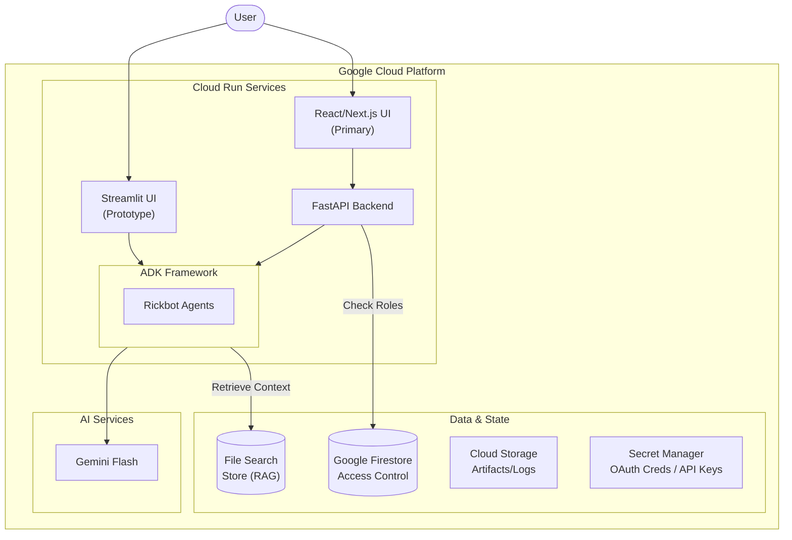

# Rickbot-ADK Design Documentation

## Overview

**Rickbot-ADK** represents the evolution of the original "Rickbot" chatbot into a sophisticated, multi-agent system. It serves as a reference implementation for creating agents using the **Google Agent Development Kit (ADK)** and for connecting a decoupled frontend to an agentic backend via a dedicated API layer, with a focus on robust personality switching.

### High-Level Architecture

The solution is architected as a cloud-native application on Google Cloud. It is containerised as a **Unified Container** and deployed onto **Google Cloud Run**.

---

## Design Decisions

### 1. Adopting the Agent Development Kit (ADK)
*   **Decision**: Migrate from custom Python logic to the Google ADK.
*   **Rationale**: ADK provides robust, standardised patterns for session handling, tool calling, and context management. The original ad-hoc state management was brittle; ADK makes the system easier to extend and maintain.

### 2. Decoupling the API (FastAPI)
*   **Decision**: Expose agent functionality via a standalone FastAPI service (`src/main.py`).
*   **Rationale**: This follows the "Backend for Frontend" (BFF) pattern, allowing multiple interfaces (React, Streamlit, etc) to coexist without duplicating core agent logic.

### 3. Container Strategy
I evaluated three potential architectures for deploying the Rickbot Backend (FastAPI) and Frontend (Next.js) to Google Cloud.

#### Option 1: Separate Cloud Run Services (Microservices)
*   **Pros**: Independent scaling, decoupled lifecycles.
*   **Cons**: Higher complexity (CORS, inter-service auth) and higher TCO.

#### Option 2: Sidecar Pattern (Two Containers, One Service)
*   **Pros**: Localhost communication, single ingress domain.
*   **Cons**: Resource contention, and increased YAML/Terraform complexity.

#### Option 3: Unified Container (Selected Strategy)
*   **Decision**: Merge both Python/FastAPI and Node/Next.js runtimes into a single Docker image managed by a lightweight orchestration script (`start-unified.sh`).
*   **Rationale**: Lowest possible TCO and minimal infrastructure complexity, behaving effectively like a "monolith" for deployment simplicity.

### 4. Hosting Environment: Cloud Run vs Agent Engine
*   **Decision**: Use **Google Cloud Run** for the unified container hosting.
*   **Rationale**: While **Vertex AI Agent Engine** provides a powerful managed runtime for agents, **Cloud Run** offers superior flexibility for hosting the "Unified Container" pattern. It allows us to manage the full-stack lifecycle (FastAPI + multiple UIs) in a single serverless service, which is more cost-effective and easier to troubleshoot for this project's reference implementation.

### 5. Authentication & Security Transition
*   **Decision**: Migrate from **Identity-Aware Proxy (IAP)** to a native **OAuth 2.0** flow using **NextAuth.js**.
*   **Rationale**:
    *   **User Experience**: IAP provides a coarse-grained security layer suitable for internal tools but lacks the seamless "Social Login" experience required for a premium reference implementation.
    *   **Granular Control**: NextAuth.js allows the application to handle session management, persona-based access control (RBAC), and user profile synchronization directly within the app logic.
    *   **Standardization**: It is the standard authentication solution for Next.js, abstracting complex OAuth flows and secure cookie handling. This ensures the application can be deployed to any Cloud Run environment without depending on specific GCP project-level features like IAP.

### 6. Storage Strategy: Firestore vs Cloud SQL
*   **Decision**: Use **Google Firestore** for structured state and RBAC.
*   **Rationale**: While **Cloud SQL (Postgres)** was considered for its relational capabilities, **Firestore** was selected for its alignment with a serverless, low-maintenance architecture:
    *   **Cost Efficiency**: Firestore’s "pay-as-you-go" model is ideal for a reference implementation; unlike Cloud SQL, there is no cost for a constantly running instance.
    *   **Simplicity**: It provides a simpler implementation path with a flexible, schemaless structure that avoids the overhead of managing database migrations.
    *   **Suitability**: The project's data (RBAC roles and user metadata) is hierarchical and relatively simple, making it perfectly suited for a document-oriented database.
    *   **Availability**: Native multi-region availability and seamless integration with the Google Cloud identity stack.
*   **Google Cloud Storage**: Leveraging the ADK `GcsArtifactService` allows the system to store user-uploaded files and agent logs reliably across container restarts without the overhead of a managed file system.

### 7. Frontend Framework: React & Next.js
*   **Decision**: Use **React** as the UI library and **Next.js** as the application framework.
*   **Rationale**:
    *   **The Ecosystem**: **React** provides the component-based architecture and "Functional UI" model, while **Next.js** provides the necessary infrastructure (routing, optimization, build system) to turn those components into a production-grade application.
    *   **SSR vs CSR**: Next.js was chosen over a pure Client-Side React app (CSR) to leverage **Server-Side Rendering (SSR)**. This ensures faster "First Meaningful Paint" and better SEO, which is critical for a reference implementation aimed at production standards.
    *   **Primary vs Prototype**: While **Streamlit** is used for internal Prototyping (due to its zero-overhead UI generation), **Next.js/React** was selected for the primary UI to allow for high-performance "Rich Chat" features, complex micro-animations (via Framer Motion), and fine-grained control over the "Thinking" state visualizations. Crucially, React offers total **Customisability**; unlike Streamlit, where interfaces often look generic and uniform, a bespoke React frontend allows us to create a unique, premium design that stands out.
    *   **Full-Stack Synergy**: Next.js’s ability to handle API rewrites and middleware makes it the perfect partner for the **Unified Container** strategy, allowing the frontend to act as a secure proxy to the FastAPI backend.

## Application Flow: The Request Lifecycle

Rickbot follows a decoupled request-response lifecycle managed by FastAPI and the ADK Runner:

1.  **Request Entry**: The React UI sends a `multipart/form-data` POST request to `/chat` or `/chat_stream`.
2.  **Authentication**: `AuthMiddleware` extracts and verifies the OAuth JWT. The user's role is validated via the `check_persona_access` dependency.
3.  **Agent Retrieval**: The system calls `get_agent(personality_name)`, which retrieves a pre-configured instance from the **Persona Cache**.
4.  **Session & Artifacts**:
    *   `session_service` retrieves or creates the conversation history in Firestore.
    *   `artifact_service` processes and stores any uploaded files as user-scoped artifacts.
5.  **Execution Logic**: The `google.adk.runners.Runner` orchestrates the interaction. It feeds the user message, session history, and available tools to the agent.
6.  **Streaming Output**: For `/chat_stream`, the `event_generator` yields ADK events (chunks, tool calls, transfers) as SSE packets, ensuring the UI reflects real-time "Thinking" states.

## Persona Implementation & Caching

Rickbot implements a sophisticated, multi-tier system for managing and retrieving agent personalities efficiently.

### 1. Lazy Persona Caching

Creating unique agent instances for every request would be computationally expensive. Rickbot uses a two-tier lazy loading strategy:
*   **Tier 1: Configuration Cache**: `get_personalities()` uses `lru_cache` to load the `personalities.yaml` and system prompts from disk/Secrets once.
*   **Tier 2: Instance Cache**: `get_agent()` uses `functools.cache` to store the fully instantiated `google.adk.agents.Agent` objects.
*   **Result**: The first request for a persona (e.g. "Yoda") triggers its creation; all subsequent requests across all users reuse the same optimized instance.

### 2. Hierarchical Agent Pattern

Each persona agent is actually a **Primary Agent** that manages a team of specialized **Sub-Agents**. We use the **Agent-as-a-Tool** pattern to maintain high focus:
*   **Primary Agent**: Handles the persona's voice and dialogue.
*   **RagAgent**: A specialist tool-agent connected to a **File Search Store**. It returns raw facts only.
*   **SearchAgent**: A fallback tool-agent with access to `google_search`.

### 3. ADK Best Practices: Specialization

Rickbot adheres to ADK best practices by avoiding "Monolithic Agents".
*   **Context Isolation**: By wrapping `google_search` and `FileSearchTool` in separate sub-agents, we prevent "Tool Confusion" where a primary agent might get bogged down with irrelevant technical outputs.
*   **Hierarchical Retrieval**: The primary agent is instructed via a **Tool Usage Policy** to prioritize `RagAgent` before falling back to `SearchAgent`.
*   **Portability**: The implementation uses `InMemorySessionService` and `InMemoryArtifactService` by default, but is architected to switch to persistent drivers (e.g., Firestore for sessions, GCS for artifacts) without modifying core agent logic.

## Implementation Details

---

## Reliability & Lessons Learned

The transition to a **Unified Container** and a **Proxied API** architecture introduced several technical hurdles. These lessons have been codified into the system's reliability patterns.

### 1. Streaming Reliability (SSE Heartbeat)
To ensure smooth "Typewriter" effects and prevent timeouts (the "Silence" and "Hang" problems) during long-running RAG operations:
*   **Heartbeat Mechanism**: A background task in `main.py` sends an SSE `: heartbeat` comment every 15 seconds.
*   **Async Queue**: Manages ADK events and heartbeats concurrently to keep the proxy connection "warm".
*   **Proxy Headers**: `X-Accel-Buffering: no` ensures the Node.js proxy does not buffer the stream.

> [!NOTE]
> For a detailed deep-dive into the "Silence", "Hang", and "Loop" problems encountered during containerisation, see the [Container Architecture Troubleshooting](file:///home/darren/localdev/python/rickbot-adk/docs/containers.md#evolution--troubleshooting-the-unified-container-journey) guide.

### 2. Application Warm-up & Resilience
*   **Race Conditions**: Handled via exponential backoff in the React frontend to wait for the backend ML libraries to initialize (the "Loading" problem).
*   **UI Feedback**: A themed loading screen ("Heating up the portal gun...") maintains user immersion during service startup.

### 3. Secrets & Key Management
*   **Production**: Cloud Run services mount secrets from **Google Secret Manager** directly as environment variables at runtime.
*   **Local Development**: Secrets are loaded from git-ignored `.env` files (e.g., `src/nextjs_fe/.env.local`).
*   **API Keys**: The system lazily injects the `GEMINI_API_KEY` only when Vertex AI is disabled (`GOOGLE_GENAI_USE_VERTEXAI=false`).

### 3. Data Management & Recovery
*   **GCS Artifacts**: Lifecycle Management policies must be configured on the bucket (e.g., delete objects > 30 days old) to avoid indefinite storage costs, as ADK does not enforce retention internally.
*   **Firestore PITR**: Point-in-Time Recovery (PITR) is enabled for the Firestore database, providing a 7-day retention window for data recovery.

### 4. Access Control (RBAC)
*   **Metadata Sync**: When a user signs in, the system automatically synchronises their details (ID, provider, email, name) to a Firestore document with a readable ID format: `{name}:{provider}:{id}`.
*   **Enforcement**: A FastAPI dependency (`check_persona_access`) validates the user's role against the required tier stored in the `persona_tiers` collection.
*   **Upgrade Path**: Denied requests return a structured `UPGRADE_REQUIRED` error, allowing the UI to trigger the appropriate subscription flow.

### 5. Data Schema (Firestore)
Firestore is utilised as a schemaless document store. The following collections and document structures define the application state:

#### Collection: `users`
Stores user profiles and access roles.
*   **Document ID**: `{SafeName}:{Provider}:{UserId}` (e.g., `Dazbo:github:derailed-dash`)
*   **Fields**:
    *   `id` (String): The unique subject ID from the identity provider.
    *   `provider` (String): The identity provider (e.g., `google`, `github`, `mock`).
    *   `email` (String): The user's primary email address.
    *   `name` (String): The full name of the user.
    *   `role` (String): The user's access level (Default: `standard`; Tiers: `supporter`, `admin`).
    *   `last_logged_in` (Timestamp): An automatically managed server timestamp.

#### Collection: `persona_tiers`
Stores the access requirements for each agent personality.
*   **Document ID**: `{persona_id}` (lowercase, e.g., `rick`, `dazbo`)
*   **Fields**:
    *   `required_role` (String): The minimum role required to interact with this persona (Default: `standard`).

---

## System Components & Interfaces

### 1. API Backend (FastAPI)
The "central nervous system" located in `src/main.py`.
*   Exposes ADK agents as RESTful endpoints.
*   Provides dynamic configuration via the `/personas` endpoint.
*   Handles multimodal input and orchestrates the ADK `Runner`.

### 2. React/Next.js UI (Primary)
The modern, production-grade interface located in `src/nextjs_fe`.
*   Built with TypeScript, React, and Material UI (MUI).
*   Consumes the FastAPI backend via Next.js rewrites (proxying `/api` requests).
*   Provides real-time visual feedback on agent "Thinking" states and tool usage.

### 3. Streamlit UI (Legacy/Prototype)
A rapid-prototyping interface located in `src/streamlit_fe`.
*   Uses OIDC authentication dynamically written to `.streamlit/secrets.toml`.
*   Implements a hard-reset pattern for personality changes to ensure total context isolation.

### 4. Artifacts & Media Workflow
Processes user-uploaded files via a **Unified Chat Request** pattern:
*   Files are sent via `multipart/form-data` in the chat request.
*   Backend persists bytes via the `ArtifactService` and passes an `inline_data` Part to the agent runner for immediate processing.
